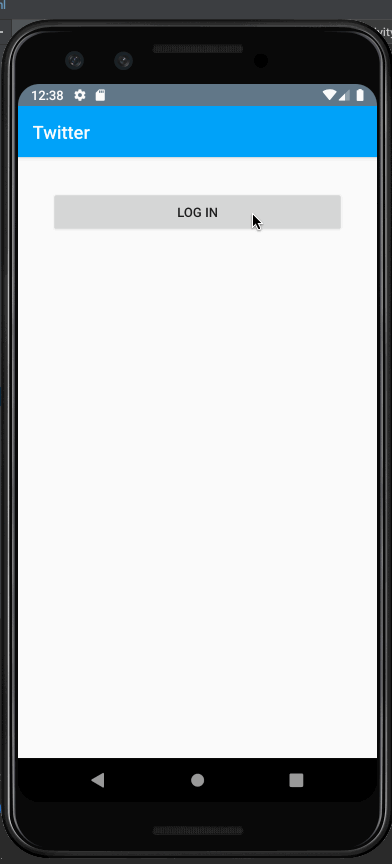

# Project 3 - *Twitter*

**Twitter** is an android app that allows a user to view his Twitter timeline and post a new tweet. The app utilizes [Twitter REST API](https://dev.twitter.com/rest/public).

Time spent: **25** hours spent in total

## User Stories

The following **required** functionality is completed:

* [X]	User can **sign in to Twitter** using OAuth login
* [X]	User can **view tweets from their home timeline**
  * [X] User is displayed the username, name, and body for each tweet
  * [X] User is displayed the [relative timestamp](https://gist.github.com/nesquena/f786232f5ef72f6e10a7) for each tweet "8m", "7h"
* [X] User can **compose and post a new tweet**
  * [X] User can click a “Compose” icon in the Action Bar on the top right
  * [X] User can then enter a new tweet and post this to twitter
  * [X] User is taken back to home timeline with **new tweet visible** in timeline
  * [X] Newly created tweet should be manually inserted into the timeline and not rely on a full refresh

The following **stretch** features are implemented:

* [X] User can **see a counter with total number of characters left for tweet** on compose tweet page
* [ ] User can **pull down to refresh tweets timeline**
* [X] User is using **"Twitter branded" colors and styles**
* [ ] User sees an **indeterminate progress indicator** when any background or network task is happening
* [ ] User can **select "reply" from detail view to respond to a tweet**
  * [ ] User that wrote the original tweet is **automatically "@" replied in compose**
* [ ] User can tap a tweet to **open a detailed tweet view**
  * [ ] User can **take favorite (and unfavorite) or reweet** actions on a tweet
* [ ] User can **see embedded image media within a tweet** on list or detail view.

The following **bonus** features are implemented:

* [ ] User can view more tweets as they scroll with infinite pagination
* [ ] Compose tweet functionality is build using modal overlay
* [ ] User can **click a link within a tweet body** on tweet details view. The click will launch the web browser with relevant page opened.
* [X] Use Parcelable instead of Serializable using the popular [Parceler library](http://guides.codepath.org/android/Using-Parceler).
* [ ] Replace all icon drawables and other static image assets with [vector drawables](http://guides.codepath.org/android/Drawables#vector-drawables) where appropriate.
* [ ] User can view following / followers list through any profile they view.
* [ ] Use the popular ButterKnife annotation library to reduce view boilerplate.
* [ ] On the Twitter timeline, leverage the [CoordinatorLayout](http://guides.codepath.org/android/Handling-Scrolls-with-CoordinatorLayout#responding-to-scroll-events) to apply scrolling behavior that [hides / shows the toolbar](http://guides.codepath.org/android/Using-the-App-ToolBar#reacting-to-scroll).
* [ ] User can **open the twitter app offline and see last loaded tweets**. Persisted in SQLite tweets are refreshed on every application launch. While "live data" is displayed when app can get it from Twitter API, it is also saved for use in offline mode.


The following **additional** features are implemented:

* [ ] List anything else that you can get done to improve the app functionality!

## Video Walkthrough

Here's a walkthrough of implemented user stories:



GIF created with [LiceCap](http://www.cockos.com/licecap/).

## Notes

Twitter API was a bit janky to use at times, and getting a new API key was necessary to continuing making API calls.

Understand the purpose of intents and how they work on a high level, but had a little bit difficulty actually implementing it myself.

Other than that, I really enjoyed this project!

(side note: I didn't complete as many stretch stories as I had hoped and worked more slowly compared other people because I typically find enjoyment in debugging and working through problems on my own rather than constantly putting my name in the support queue and getting instant help from a TA. I find myself gaining a lot more from the experience this way instead of quickly getting through the stretch stories and not really understanding what's going on. )

## Open-source libraries used

- [Android Async HTTP](https://github.com/loopj/android-async-http) - Simple asynchronous HTTP requests with JSON parsing
- [Glide](https://github.com/bumptech/glide) - Image loading and caching library for Android

## License

    Copyright [yyyy] [name of copyright owner]

    Licensed under the Apache License, Version 2.0 (the "License");
    you may not use this file except in compliance with the License.
    You may obtain a copy of the License at

        http://www.apache.org/licenses/LICENSE-2.0

    Unless required by applicable law or agreed to in writing, software
    distributed under the License is distributed on an "AS IS" BASIS,
    WITHOUT WARRANTIES OR CONDITIONS OF ANY KIND, either express or implied.
    See the License for the specific language governing permissions and
    limitations under the License.
    // Load json array into model classes
  }
});
```

You can then load the data into your models from a `JSONArray` using:

```java
ArrayList<Tweet> tweets = Tweet.fromJSON(jsonArray);
```

or load the data from a single `JSONObject` with:

```java
Tweet t = new Tweet(json);
// t.body = "foo"
```

To save, you will need to perform the database operation on a separate thread by creating an `AsyncTask` and adding the item:

```java
AsyncTask<Tweet, Void, Void> task = new AsyncTask<Tweet, Void, Void>() {
    @Override
    protected Void doInBackground(Tweet... tweets) {
      TwitterDao twitterDao = ((RestApplication) getApplicationContext()).getMyDatabase().twitterDao();
      twitterDao.insertModel(tweets);
      return null;
    };
  };
  task.execute(tweets);
```

That's all you need to get started. From here, hook up your activities and their behavior, adjust your models and add more REST endpoints.

### Extras

#### Loading Images with Glide

If you want to load a remote image url into a particular ImageView, you can use Glide to do that with:

```java
Glide.with(this).load(imageUrl)
     .into(imageView);
```

This will load an image into the specified ImageView and resize the image to fit.

#### Logging Out

You can log out by clearing the access token at any time through the client object:

```java
RestClient client = RestApplication.getRestClient();
client.clearAccessToken();
```

### Viewing SQL table

You can use `chrome://inspect` to view the SQL tables once the app is running on your emulator.  See [this guide](https://guides.codepath.com/android/Debugging-with-Stetho) for more details.

### Troubleshooting

* If you receive the following error `org.scribe.exceptions.OAuthException: Cannot send unauthenticated requests for TwitterApi client. Please attach an access token!` then check the following:
 * Is your intent-filter with `<data>` attached to the `LoginActivity`? If not, make sure that the `LoginActivity` receives the request after OAuth authorization.
 * Is the `onLoginSuccess` method being executed in the `LoginActivity`. On launch of your app, be sure to start the app on the LoginActivity so authentication routines execute on launch and take you to the authenticated activity.
 * If you are plan to test with Android API 24 or above, you will need to use Chrome to launch the OAuth flow.  
 * Note that the emulators (both the Google-provided x86 and Genymotion versions) for API 24+ versions can introduce intermittent issues when initiating the OAuth flow for the first time.  For best results, use an device for this project.
